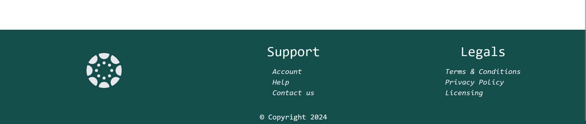

# AI-Powered Content Summarizer Dashboard with Web Scraping features

This project is an 
AI-powered content summarizer with web scraping capabilities. It allows users to scrape any website by simply entering the URL, edit the response, paste or write content, and let the AI summarize it to the desired length. The summary can be downloaded in various formats (.pdf, .txt, .json, .csv).

The project emphasizes functionality, component reusability, and maintaining a single source of truth using Redux Toolkit. It features a clean, industry-standard development structure and a user-friendly, responsive interface. The design approach is detailed at the end of this document.

>I have used Abstract’s Web Scraping API for website scraping, it has few limited free requests !! 

> ** Important!** Landscape mode in phones is not handled in resonsiveness 

## Table of Contents

- [Installation](#installation)
- [Features](#features)
- [UI/UX Design](#designs)
- [Screenshots](#screenshots)

## Installation

Step-by-step instructions on how to get the development environment running in you system.

### initial setup
```bash
# Clone the repository
git clone https://github.com/yourusername/your-repository.git

# Navigate to the project directory
cd your-repository

# Install dependencies
npm install
```
### Steps to run
1. You need to create an account and project on appwrite to store the data and for user authentication and authorization.

2. Create an .env file in repo root directory

```javascript
VITE_APPWRITE_URL = "" //(endpoint)
VITE_APPWRITE_PROJECT_ID = ""
VITE_APPWRITE_DATABASE_ID = ""
VITE_APPWRITE_COLLECTION_ID = ""
VITE_ABSTRACTION_API_KEY = ""
```
3. Create an folder inside src named conf and then create a file inside conf.js and write these values to import clean
```javascript
const conf = {

    appwriteUrl : String(import.meta.env.VITE_APPWRITE_URL),

    appwriteProjectId : String(import.meta.env.VITE_APPWRITE_PROJECT_ID),

    appwriteDatabaseId : String(import.meta.env.VITE_APPWRITE_DATABASE_ID),

    appwriteCollectionId : String(import.meta.env.VITE_APPWRITE_COLLECTION_ID),

    abstractApiKey : String(import.meta.env.VITE_ABSTRACTION_API_KEY)

}

export default conf
```

``` bash 
# now run the project
npm run dev
```
4. Create an account - Signup or Login to access
5. After than you land on dashboard


## Features
1. ### Clean, Responsive, and User-Friendly Interface
    The dashboard is designed to be intuitive and easy to navigate, providing a seamless user experience across different devices and screen sizes.

2. ### AI-Powered Content Summarization
    Leverages advanced AI algorithms to accurately summarize content based on user-specified length, improving readability and extracting key information efficiently.

3. ### Web Scraping Feature with Editable Responses
    Allows users to scrape content from any website by entering the URL. The scraped content can be edited before summarization, providing flexibility in content handling.

4. ### Multiple Download Formats
    Enables users to download the summarized content in various formats, including PDF, TXT, JSON, and CSV, catering to different needs and preferences.

5. ### User History of Scraped Website URLs
    Tracks and saves the history of scraped URLs, allowing users to revisit and reuse previously scraped content without re-entering the URLs.

6. ### User Review Before Summarization
    Provides a review step before finalizing the summarization, allowing users to make necessary edits and adjustments to the content.

7. ### AI Summarization Based on Desired Word Length
    Allows users to specify the desired length of the summary in words, providing control over the level of detail and conciseness.

8. ### Eye-Catching UI Design with Error Handling
    Features a visually appealing design with robust error handling mechanisms to enhance user experience and ensure smooth operation.

## Designs
(Detailed design approach, wireframes, and design considerations here.)

By following industry standards and focusing on component reusability and a clean development structure, this project aims to provide a robust and user-friendly solution for content summarization and web scraping.


## Screenshots
### Landing
- 
---
- 
- 
---
### Dashboard
- 
---
### Ai summarizer


---
### Web Scraped 
 

---
### Footer



